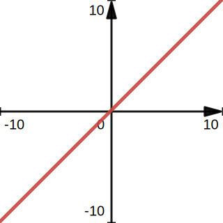
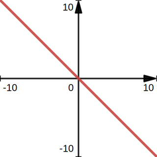

# 10.一次函数

## 一次图像的函数与性质
1. 一次函数的图像与性质
    b确定直线与y轴的交点位置    
    |   |   | 图像形状:  | 一条直线 |  |
    | - | - | - | --- | -|
    |解析式 |  | k>0 | k<0 | 经过点 | |
    |y=kx | b=0 |  |  | (0,0) (1,k)|
    |y=kx+b| b>0 |  |  | (0,b) | |
    | | b<0 |  |  | (-$$\Large\frac{b}{k}$$,0) | |
    |性质 | | y随x的增大而增大 | y随x的增大而减小 | | |
    | | | k确定直线的变化趋势 | b确定直线与y轴的交点位置 | |
2. 平移规律:        
    一次函数y=kx+b的图像        
    可由正比函数y=kx的图像平移得到，    
    若b>0，则向上b个单位；      
    若b<0，则向下平移|b|个单位      

## 用待定系数法求一次函数的解析式
用待定系数法求一次函数的解析式，    
通常先设函数解析式为$$\color{red}{y=kx+b(b\neq0)}$$，   
把已知点的坐标带入函数解析式，  
可得方程(组)，求出未知系数，    
从而可得这个函数的解析式。  

## 一次函数与方程(组)、不等式的关系
1. 一次函数与医院一方程之间的关系： 
    一次函数$$y=kx+b(b\neq{\color{red}{0}})$$的函数值为0时，
    相应的自变量的值为方程$$kx+b=0$$的解
2. 一次函数与一元一次不等式之间的关系：
    一次函数$$y=kx+b(b\neq0)$$的函数值大于(或小于)0，
    相应的自变量的值为不等式$$kx+b{\Large\color{red}{\gt}}0(或kx+b{\Large\color{red}{\lt}}0)$$的解。
3. 一次函数与方程组之间的关系：
    两直线的交点是两个一次函数解析式
&所组成的方程组
&\begin{cases}
y=k_1x+b_1\\
y=k_2x+b_2
\end{cases}\\
&的解。
\end{array}
$$
\begin{array}{r l l l}
1&一次函数与医院一方程之间的关系：\\
&一次函数y=kx+b(b\neq{\color{red}{0}})的函数值为0时，\\
&相应的自变量的值为方程kx+b=0的解\\
2&一次函数与一元一次不等式之间的关系：\\
&一次函数y=kx+b(b\neq0)的函数值大于(或小于)0，\\
&相应的自变量的值为不等式kx+b{\Large\color{red}{\gt}}0(或kx+b{\Large\color{red}{\lt}}0)的解。\\
3&一次函数与方程组之间的关系：\\
&两直线的交点是两个一次函数解析式\\
&所组成的方程组\\
&\begin{cases}
y=k_1x+b_1\\
y=k_2x+b_2
\end{cases}\\
&的解。
\end{array}
$$