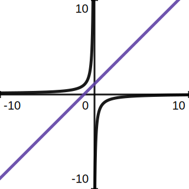
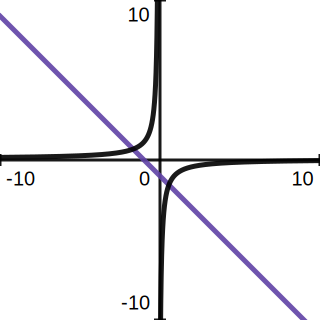
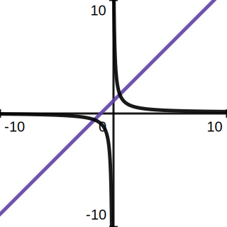
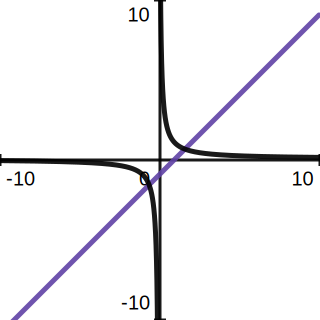
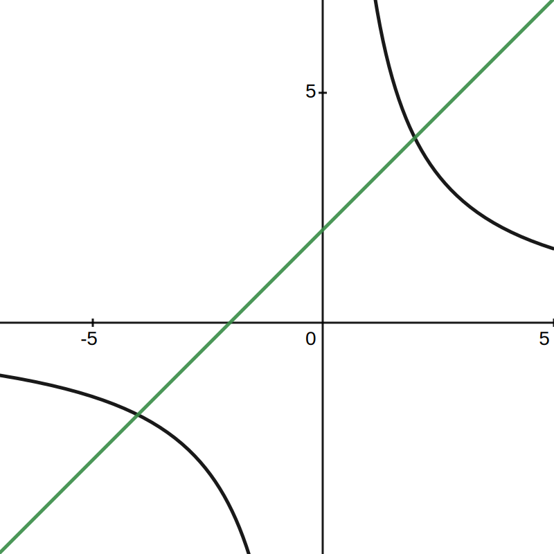

# 例题

## 例题
1. $$\begin{array}{l}
当a\neq0时，\\函数y=ax+1与函数y=\frac{a}{x}\\在同一平面直角坐标系中\\的图像可能是
\end{array}
    $$
    
    | 选项 | 图片 |
    | - | - |
    | A ||
    | B ||
    | C ||
    | D ||

2. 如图所示，已知一次函数与反比例函数       
    的图像交于点A(-4,-2)和B(a,4).
    
    1. 求反比例函数的解析式和点B的坐标；
       1. 肉眼可得反比例函数解析式是y=8/x
          1. (-4*-2=8)
       2. 于是点b的坐标就是(2,4)
          (皮一下很开心)
    2. 根据图像回答，当x在什么范围内时，一次函数的值大于反比例函数的值？
       1. -4<x<0
       2. x>2