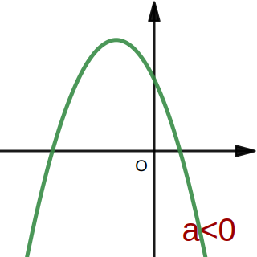

# 12.二次函数的图像与性质

1. 二次函数的解析式主要有三种形式：
    $$
    \begin{array}{r l l l}
    一般式&y=ax^2+bx+c\\
    &(a,b,c为常数，且a\neq0)\\\hdashline
    顶点式&y=a(x-h)^2+k\\
    &(a,h,k为常数，且a\neq0)，\\
    &其中抛物线的顶点为(h,k)。\\\hdashline
    交点式&设抛物线与x轴交于\\
    &点A(x_1,0)，B(x_2,0)，\\
    &则抛物线的函数解析式为\\
    &y=a(x-x_1)(x-x_2)(a\neq0)
    \end{array}
    $$
2. 求二次函数的解析式时，   
   应根据所给条件，   
   灵活选择函数解析式，   
   然后用待定系数法求出未知系数的值。
    1. 已知抛物线上的三点，可设为一般式；
    2. 已知抛物线的顶点、对称轴最大(小)值， 
        可设为顶点式；
    3. 若已知抛物线与x轴的两个交点，    
        可设为交点式或一般式。

## 二次函数的图像与性质
$$
\begin{array}{r l l l }
1.&二次函数y=ax^2+bx+c\\
&(a,b,c为常数，a\neq0)的图像是一条\\
&{\color{red}{抛物线}}\\\hdashline
2.&二次函数y=ax^2+bx+c\\
&(a,b,c为常数，a\neq0)的性质：
\end{array}
$$

 |

$$
\begin{array}{c|c}
性质&
\begin{array}{r|c}
性质&\begin{array}{c|c}
a\gt0&a\lt0
\end{array}\\\hline
\begin{array}{c}
开口\\方向
\end{array}&
\begin{array}{c|c}
开口向上，并向上&开口向下，并向下\\
方无限延伸&方无限延伸
\end{array}
\\\hline
对称轴&x=\LARGE-\frac{b}{2a}\\\hline
\begin{array}{}顶点\\坐标\end{array}
&\LARGE(-\frac{b}{2a},\frac{4ac-b^2}{4a})\\\hline
增减性&\begin{array}{}
\begin{array}{c|c}
\begin{array}{}
当x\gt-\Large{\frac{b}{2a}}\normalsize时\\
y随x的增大而{\color{red}{增大}}
\\当x\lt-\Large{\frac{b}{2a}}\normalsize时\\
y随x的增大而{\color{red}{减小}}
\end{array}
&\begin{array}{}
当x\gt-\Large{\frac{b}{2a}}\normalsize时\\
y随x的增大而{\color{red}{减小}}\\
当x\lt-\Large{\frac{b}{2a}}\normalsize时\\
y随x的增大而{\color{red}{增大}}
\end{array}
\end{array}
\end{array}\\\hline
最值&\begin{array}{c|c}
\begin{array}{}
当x=-\Large{\frac{b}{2a}}\normalsize时\\
y有最小值，\\
y_{min}=\Large\frac{4ac-b^2}{4a}
\end{array}
&\begin{array}{}
当x=-\Large{\frac{b}{2a}}\normalsize时\\
y有最大值，\\
y_{max}=\Large\frac{4ac-b^2}{4a}
\end{array}
\end{array}
\end{array}
\end{array}
$$