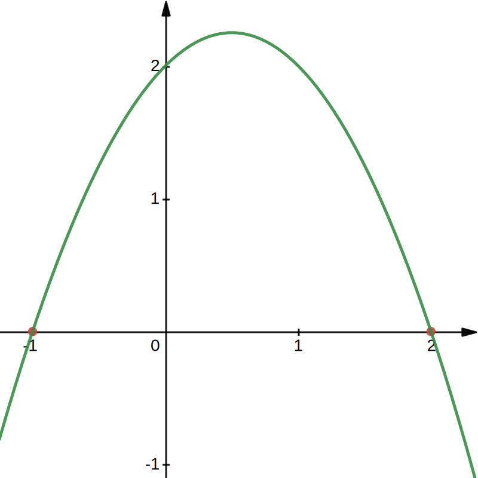

# 例题

## 理解性例题
1. $$y=ax^2经过P(2,16)$$
    * $$y=4x^2$$代入求值
2. $$y=ax^2+bx+c\\顶点A(2,1)，经过B(1,0)$$
    * $$顶点A(2,1)，经过B(1,0)\\设顶点式y=a(x-2)^2+1\\代入B(1,0)\\0=a(1-2)^2+1\\0=a+1\\a=-1\\\therefore y=-(x-2)^2+1\\展开y=-x^2+4x-3$$
3. 二次系数为-1的抛物线S1\_1如图所示    

求解析式
    * $$x轴交点为x_1为-1，x_2为2\\使用交点式y=a(x-x_1)(x-x_2)(a\neq0)\\y=-1[x-(-1)](x-2)\\y=-(x+1)(x-2)\\y=-x^2+2x-x+2\\y=-x^2+x+2$$
4. 抛物线$$y=-2x^2+1$$的对称轴是(C)
    | | |
    | - | - |
    |A. 直线$$x=\frac{1}{2}$$ | B. 直线$$x=-\frac{1}{2}$$ |
    |C. y轴 | D.直线$$x=2$$ |

