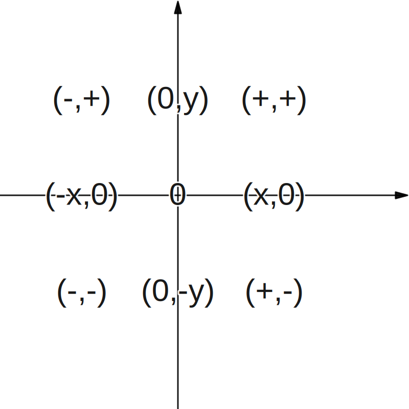

# 9.平面直角坐标系与函数

## 平面直角坐标系
1. 点P(x,y)到x轴的距离是|y|，到y轴的距离是|x|。
2. 平面直角坐标系内点的坐标特征     
    

## 平面直角坐标系中点的对称与平移

1. 点的对称
   | | 关于x轴对称 | 关于y轴对称 | 关于原点对称 |
   | - | - | - | - |
   | P(a,b) | (a,-b) | (-a,b) | (-a,-b) |
2. 点的平移
   | | | | |
   |-|-|-|-|
   |p(x,y)|左右 平移|向左|P(x,y)向左平移a个单位(x-a,y)|
   | | |向右 | P(x,y)向右平移a个单位(x+a,y)|
   | |上下 平移 |向上 | P(x,y)向上平移b个单位(x,y+b)|
   | | |向下 | P(x,y)向下平移b个单位(x,y-b)|
3. 点的旋转
   | | | |
   | - | - | - |
   |顺时针旋转90| (x,y) | (y,-x)|
   |逆时针旋转90| (x,y) | (-y,x) |

## 函数及其图像
1. 根据函数解析式确定自变量的取值范围
    | 函数解析式 | 自变量取值范围的确定 |
    | - | - |
    | 整式形式 | **全体实数** |
    | 分式形式 | 分母**不等于0** |
    | 含算术平方根 | 被开方数**大于等于0** |
    |含零指数 | 底数**不等于**0 |
2. 函数的三种表示法：**列表法**、**图像法**和**解析式法**。
3. 函数图像的画法：
   1. 一般步骤为
      1. 列表
      2. **描点**
      3. **连线**
4. 在平面直角坐标系中，     
   函数图像中的y随x的变化而变化。
   1. 当x自左向右变化时：  
        1. 函数图像处于上升部分的       
        说明y在逐渐增大；
        2. 函数图像处于水平部分的，     
           说明y保持不变；
        3. 函数处于下降部分的，     
           说明y在逐渐**减小**。